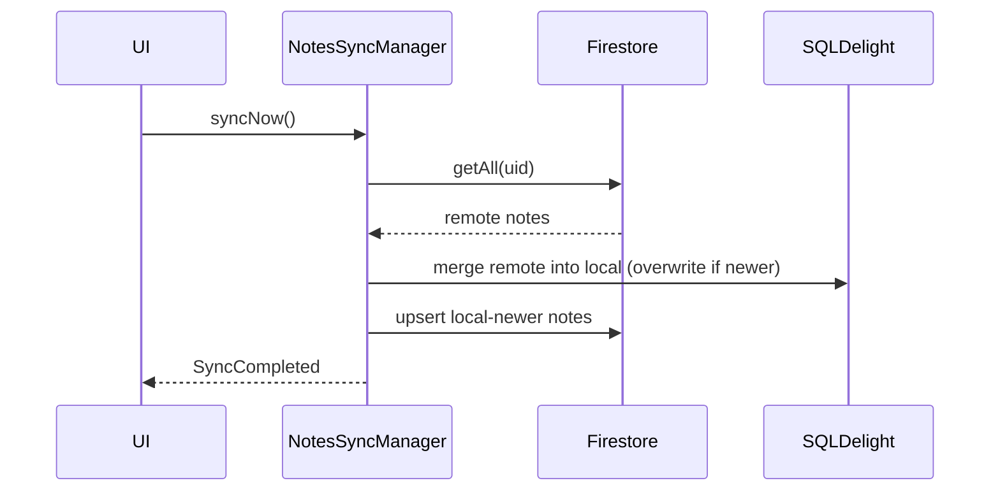
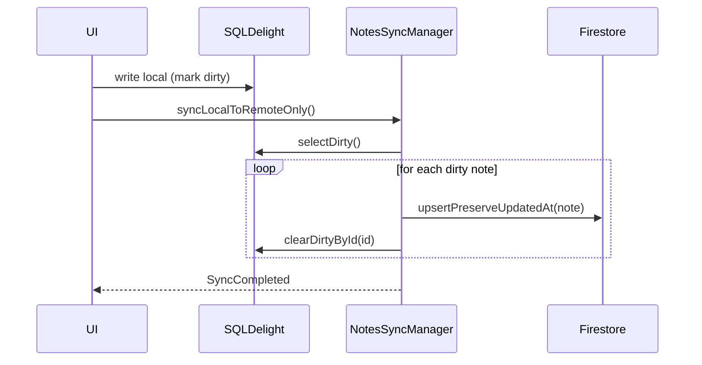
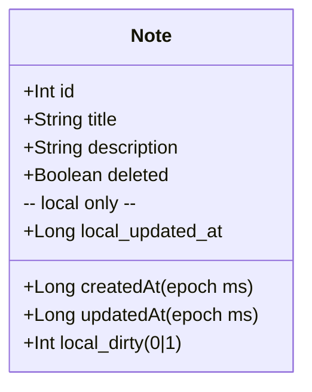
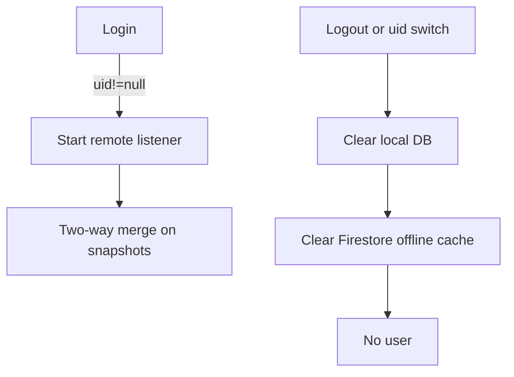

<h1 align="center">Amazing Note</h1>

<p align="center">
  <a href="https://android-arsenal.com/api?level=24"></a>
  <a href="https://github.com/edufelip"></a>
  <a href="https://medium.com/@eduardofelipi"></a> <br>
  <a href="https://www.youtube.com/channel/UCYcwwX7nDU_U0FP-TsXMwVg"></a> 
  <a href="https://github.com/edufelip"></a> 
  <a href="https://www.linkedin.com/in/eduardo-felipe-dev/"></a> 
</p>

<p align="center">  
🗡️ Amazing Note is a note-taking app designed to collect and organize text!
</p>

<p align="center">

</p>

## Download
Go to [Google Play](https://play.google.com/store/apps/details?id=com.edufelip.amazing_note) to download the latest App version.

## This project uses
* Compose Multiplatform UI (shared Android/iOS), Material 3 (Material You)
* SQLDelight (shared persistence)
* Kotlin Coroutines
* Koin (multiplatform DI)
* Firebase Authentication (Android/iOS)
* Google Identity Services (Android sign-in via Credential Manager + Google ID)
* JUnit and Mockito for unit tests

Key recent changes
- One shared SQLDelight database instance is used by UI and sync to avoid state drift.
- Logout or account switch clears the local DB and Firestore offline cache so notes are not visible across sessions.
- Sync can run in push-only mode (local → remote): only dirty local changes are uploaded, and remote is not merged back.
- Firestore `createdAt`/`updatedAt` are stored as Timestamp; push-only preserves `updatedAt` to keep list order stable.
- Swipe-to-delete removed; delete/restore are explicit actions.
- Notes list uses a single simple scroll; section labels (Today/This week/This month/Earlier) are not sticky.
- Shared scaffold abstraction now powers adaptive navigation: Android switches between a glass bottom bar (phones) and navigation rail + list/detail layout on larger devices, while iOS keeps platform-specific chrome through the same contract.
- Local SQLDelight storage is now encrypted end-to-end with AES-CTR + HMAC; keys are fetched from Android EncryptedSharedPreferences and the iOS Keychain (legacy data is migrated on first launch).
- Folder experiences were tightened: folders search/header spacing is slimmer, grid cards are shorter, the empty-state CTA breathes, global navigation now fades between screens, and backing out of a new note prompts a localized "Discard" dialog.

## Installation
Clone this repository and import into **Android Studio**
```bash
git clone https://github.com/edufelip/amazing-note.git
```
or

```bash
git clone git@github.com:edufelip/amazing-note.git
```

## Build & Run

Android
- Requirements: JDK 17, Android SDK
- Commands:
  - Build debug APK: `./gradlew :app:assembleDebug`
  - Install on device: `./gradlew :app:installDebug`
  - Unit tests: `./gradlew :app:testDebugUnitTest`
  - Lint: `./gradlew :app:lintDebug`
 - Gradle Wrapper: 9.0-milestone-1

iOS (SwiftPM + ComposeApp Framework)
- Requirements: Xcode 15+, JDK 17
- First-time setup / refresh shared framework slices:
  - `./scripts/rebuild_ios.sh`
- Open the project in Xcode:
  - `open iosApp/iosApp.xcodeproj`
- Manual Gradle invocation if you prefer not to use the helper script:
  - `./gradlew -PCONFIGURATION=Debug -PSDK_NAME=iphonesimulator :composeApp:packForXcode :iosApp:packForXcode`
- Subsequent runs: Xcode picks up the freshly synced `ComposeApp.framework` from `iosApp/Frameworks/<CONFIGURATION>-<platform>/`, so hitting Run in Xcode is enough.
- Android Studio integration: the `iosApp` Kotlin Multiplatform module now exposes the usual `runDebugExecutableIosSimulatorArm64` task, so the KMM plug-in restores the iOS run configuration (it still defers to Xcode/`run_ios_app.sh` for real execution).

Notes
- Ensure `GoogleService-Info.plist` is present in `iosApp/iosApp/` and your URL scheme (REVERSED_CLIENT_ID) is set in `Info.plist`.
- Google Sign-In currently falls back to Android only (the iOS launcher returns `null` until a native integration is added).

### iOS Firebase frameworks

GitLive’s Firebase KMP bindings do **not** bundle the native Firebase Apple binaries. When linking the iOS targets (including tests) make sure the following pods or SPM packages are available to Xcode:

```kotlin
cocoapods {
    pod("FirebaseCore")
    pod("FirebaseAuth")
    pod("FirebaseFirestore")
    pod("FirebaseStorage")
    pod("FirebaseCrashlytics")
}
```

Without them the linker will fail with `framework 'FirebaseCore' not found` when Gradle builds the Kotlin/Native test executables.

Expose the directory containing the built xcframeworks to Gradle at build time:

```bash
./gradlew :shared:check -Pfirebase.ios.frameworks.dir="/path/to/FirebaseXCFrameworks"
```

Point it at the folder that contains `FirebaseCore.xcframework`, `FirebaseAuth.xcframework`, etc. (If you use SwiftPM, Xcode caches them under `~/Library/Developer/Xcode/DerivedData/.../SourcePackages/artifacts`).

Firestore rules
- Per-user access is required or Firestore will reject writes (PERMISSION_DENIED). Example rules:
```
rules_version = '2';
service cloud.firestore {
  match /databases/{database}/documents {
    match /users/{userId}/notes/{noteId} {
      allow read, write: if request.auth != null && request.auth.uid == userId;
    }
  }
}
```

## CI Hints
Minimal CI steps you can copy into your pipeline:

- Android (GitHub Actions job snippet)
```
    - name: Set up JDK 21
      uses: actions/setup-java@v4
      with:
        distribution: /Users/eduardosantos/Library/Java/JavaVirtualMachines/jbr-21.0.8
        java-version: '21'
    - name: Build Debug APK
      run: ./gradlew :app:assembleDebug --stacktrace
    - name: Spotless Check (format enforcement)
      run: ./gradlew spotlessCheck --stacktrace
    - name: Verify Localization
      run: ./gradlew verifyL10n --stacktrace
```

- iOS (macOS runner) – SwiftPM + ComposeApp framework
```
    - name: Set up JDK 21
      uses: actions/setup-java@v4
      with:
        distribution: /Users/eduardosantos/Library/Java/JavaVirtualMachines/jbr-21.0.8
        java-version: '21'
    - name: Build Compose framework and run xcodebuild
      run: ./scripts/rebuild_ios.sh
    - name: Spotless Check (format enforcement)
      run: ./gradlew spotlessCheck --stacktrace
    - name: Verify Localization
      run: ./gradlew verifyL10n --stacktrace
```

## CI Aggregator
- A convenience task `ci` runs formatting check, build, tests, lint, and l10n verification:
  - `./gradlew ci`

## Formatting
- The project uses Spotless + ktlint for formatting and import optimization (IDE equivalents of Cmd+Opt+L and Ctrl+Alt+O):
  - Apply formatting: `./gradlew spotlessApply`
  - Check formatting only: `./gradlew spotlessCheck`
  - CI runs `spotlessCheck` as part of the `ci` task.

## Android Previews
- Android previews need the shared theme wrapper. Use:
  - `DevicePreviewContainer { /* your composable */ }`
  - Optional multi-device annotation: `@DevicePreviews`
  - Source: `composeApp/src/commonMain/kotlin/com/edufelip/shared/ui/preview/PreviewScaffold.kt`

## Navigation Helpers (Compose UI)
- In-memory navigation for the shared UI uses a simple back stack of `AppRoutes`.
- Reusable helpers live in `composeApp/src/commonMain/kotlin/com/edufelip/shared/ui/nav/BackStackHelpers.kt`:
  - `backStack.navigate(AppRoutes.SomeRoute)` – push (singleTop by default)
  - `backStack.goBack()` – pop if possible, returns `true` if popped
  - `backStack.popToRoot()` – clear to root
  - Prefer these over direct `add/remove` to keep behavior consistent.

## Compose UI Structure
- Compose UI follows an atomic hierarchy under `composeApp/src/commonMain/kotlin/com/edufelip/shared/ui/components/`:
  - `atoms/` for foundational controls (buttons, indicators, small visuals).
  - `molecules/` for small reusable clusters (e.g., note rows, folder cards).
  - `organisms/` for larger connected widgets, layouts, and empty states.
- Feature-specific surfaces live in `composeApp/src/commonMain/kotlin/com/edufelip/shared/ui/features/<feature>/` with nested folders such as `screens/`, `components/`, and `dialogs/`.
- Every reusable component and screen owns its own `@Preview`; platform-specific preview providers mirror the same feature structure under `composeApp/src/{androidMain,iosMain}/kotlin/com/edufelip/shared/ui/features/`.
- When creating new UI, start with an atom or molecule in `ui/components`, compose them into an organism if needed, and keep feature wiring inside `ui/features/.../screens`.

## Dependency Injection (Koin + SQLDelight)

Architecture (Clean): UI → ViewModel → UseCases → Repository → Data Source

- UI (Compose Multiplatform in `composeApp`) consumes the shared `NoteUiViewModel` interface.
- `DefaultNoteUiViewModel` lives in `composeApp` and depends only on `NoteUseCases`.
- `NoteUseCases` depend on the domain `NoteRepository` (implemented by `SqlDelightNoteRepository`).
- All of the above are registered inside the Koin modules under `composeApp/src/commonMain/kotlin/com/edufelip/shared/di/`.

Each platform contributes a `platformModule()` implementation:

- Android installs `AndroidSettings`, the SQLDelight driver, and the repository, then starts Koin from `ItemApplication` using `androidContext`.
- iOS registers `IosSettings`, the native SQLDelight driver, and the repository when `MainViewController` launches.

Whichever shell needs a dependency (Android Activity, iOS controller, previews) simply grabs it from `getSharedKoin()` and hands it to `AmazingNoteApp`. No platform-specific ViewModel wrapper is required any longer.

Authentication on Android still uses FirebaseAuth + Google Identity Services. Credential Manager retrieves an ID token which is exchanged with FirebaseAuth; `MainActivity` wires that into the shared UI alongside the `NoteUiViewModel` pulled from Koin.

MainActivity follows this pattern and is the app launcher.

## Material You & UX
- Dynamic color-aware theme on Android and iOS.
- Section labels grouped by date (Today, This week, This month, Earlier) – labels scroll with content (not sticky).
- Search bar anchored directly above the notes feed.
- Toggle between Created vs. Updated for grouping and note timestamps.
- Persisted UI state:
  - Dark theme toggle
  - Date mode (Created vs. Updated)
- Note editor now highlights tapped images, deletes them on any key press (including backspace when the caret sits after an image), renames the CTA to “Add Image,” and exposes centered undo/redo controls backed by a 20-step stack.

Delete/Restore
- Swipe gestures were removed to avoid accidental actions.
- Delete from Home sets a soft-delete flag (moves to Trash) and runs a push-only sync to update remote immediately.
- Restore from Trash clears soft-delete and runs push-only sync.

## Localization
- Shared UI uses a common string key set (`shared/i18n/Strings.kt`) and CompositionLocal `LocalStrings`.
- Providers require platform-native resources by `Str.serialized` key (no shared fallback):
  - Android: `AndroidStrings` looks up `R.string.<key>` dynamically via resource name and formats with `getString(resId, *args)`. Missing keys throw to catch gaps early.
  - iOS: `IosStrings` uses `NSBundle.mainBundle.localizedStringForKey(key)` with basic `%d`/%@ formatting. Missing keys throw to catch gaps early.
- Android string resources live in `shared/src/androidMain/res/values*`.
- iOS localizations are stored under:

  - `iosApp/amazingnote/en.lproj/Localizable.strings`
  - `iosApp/amazingnote/es.lproj/Localizable.strings`
  - `iosApp/amazingnote/pt-BR.lproj/Localizable.strings`

Usage:
- Android `KmpActivity`: wrap content with `ProvideAndroidStrings { ... }`.
- iOS `MainViewController`: wrap content with `ProvideIosStrings { ... }`.

New groups and relative time strings added for headers and time labels. If you localize iOS, add keys:
- `today`, `this_week`, `this_month`, `earlier`
- `updated`, `created`, `updated_just_now`, `updated_minutes_ago`, `updated_hours_ago`, `updated_days_ago`, `created_just_now`, `created_minutes_ago`, `created_hours_ago`, `created_days_ago`

## Layouts
<br>
  <p align="left">
            
            
            
            

  
## Generating APK
From Android Studio:
1. ***Build*** menu
2. Generate ***Bundle(s) / APK(s)***
3. Build ***APK(s)***
4. Wait for Android studio to build the APK

## Maintainers
This project is mantained by:
* [Eduardo Felipe](http://github.com/edufelip)

## Contributing

1. Fork it
2. Create your feature branch (git checkout -b my-new-feature)
3. Commit your changes (git commit -m 'Add some feature')
4. Push your branch (git push origin my-new-feature)
5. Create a new Pull Request

## Diagrams

Architecture Overview

```mermaid
flowchart LR
  subgraph UI[Compose UI (shared)]
    A[Home/List/Detail/Trash]
  end
  VM[NoteUiViewModel (shared via Koin)]
  UC[NoteUseCases]
  REP[NoteRepository]
  subgraph Local[Local Persistence]
    SQL[SQLDelight NoteDatabase\n(note table)]
  end
  subgraph Cloud[Cloud]
    FS[Firestore\nusers/{uid}/notes/{id}]
  end
  SYNC[NotesSyncManager]

  A --> VM --> UC --> REP --> SQL
  SYNC <--> SQL
  SYNC <--> FS
  VM -. auth state .-> SYNC
```

Sync Modes

Two‑way merge (login/explicit sync):


Push‑only (insert/update/delete/restore):


> **Offline-first:** When no Firebase user is signed in we skip `syncLocalToRemoteOnly()` and attachment uploads, so edits (and their local image files) stay on-device until the next authenticated save.

Data Model



Auth State and Clearing



## Data sync and offline

- Local database: SQLDelight (Android: `AndroidSqliteDriver`, iOS: native driver). DB name: `notes.db`.
- Firestore: `users/{uid}/notes/{id}`; documents contain id, title, description, deleted (bool), createdAt (Timestamp), updatedAt (Timestamp).
- Two sync modes used in the app:
  - Two‑way merge: fetches remote, merges into local, and pushes local‑newer to remote (used on login and some flows).
  - Push‑only: uploads only local dirty changes; does not merge from remote (used on insert/update/delete/restore flows). Push‑only preserves `updatedAt` to avoid reordering.
- Dirty tracking: the `note` table has `local_dirty` and `local_updated_at` columns to mark local edits. Push‑only syncs only dirty rows and clears the flag after successful push.
- Logout/account switch: local DB is wiped and Firestore offline cache cleared to prevent cross‑account leakage.

Immediate population after login
- After login, the app triggers a one‑shot sync so notes appear on Home right away.
- A brief loading bar appears on Home while the first sync completes.

Where the schema lives
- Main schema and queries: `shared/src/commonMain/sqldelight/com/edufelip/shared/db/Note.sq`
- Migrations: `shared/src/commonMain/sqldelight/com/edufelip/shared/db/migrations/`
- SQLDelight config: `shared/build.gradle.kts` under `sqldelight { databases { ... } }`

About SQLDelight query result types
- Named queries that list columns generate a named result type (e.g., `SelectAll`).
- To get the generated table row type (`com.edufelip.shared.db.Note`), write `SELECT *`.
- You can also provide a mapper to return your domain model directly from a query.

QA checklists
- Full test plan: `docs/QA_TEST_PLAN.md`
- Quick regression list: `docs/QA_CHECKLIST.md`
